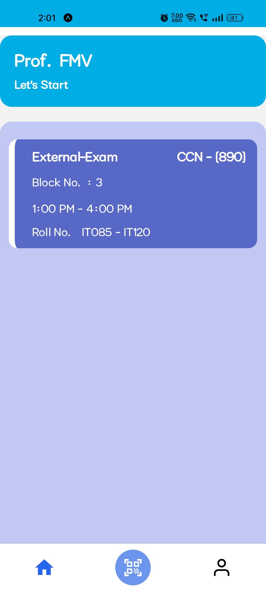
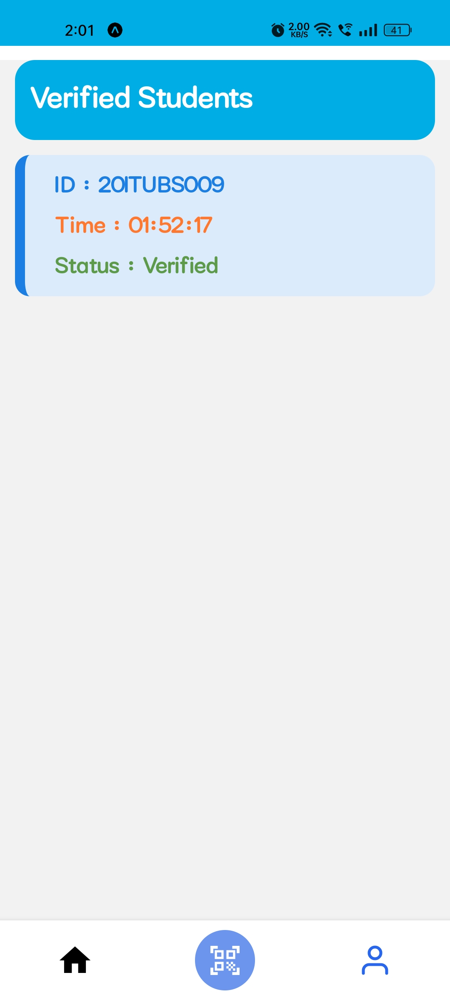
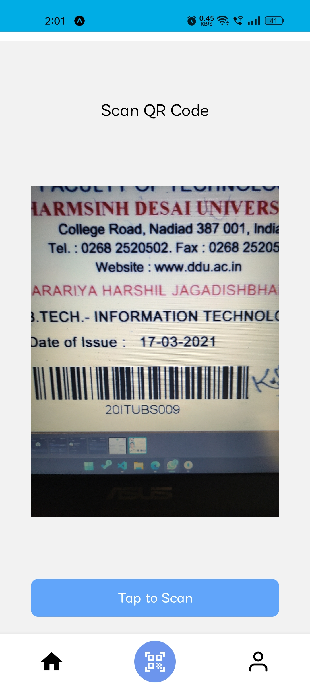
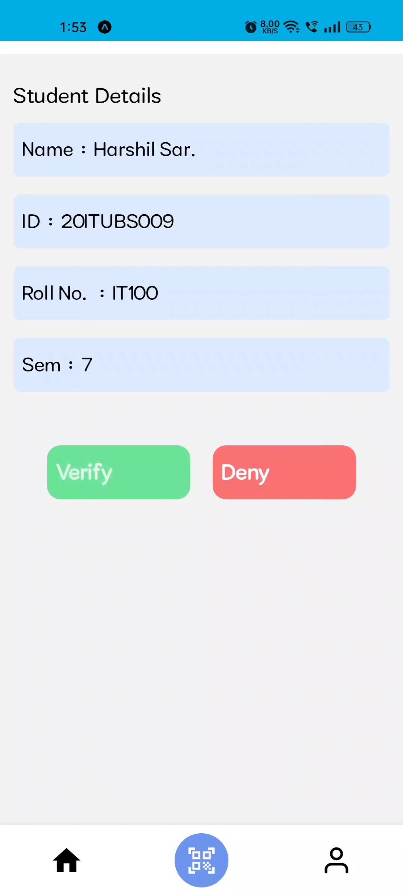

# VerifyIt

<!-- # Daily Expense Tracker - Expensify -->

VerifyIt is a mobile application which helps faculty to verify students who are sitted in examination hall. On the other hand admin/exam dept. head (Web based interface) can assign various blocks to different different faculties and in turn each faculty can verify blocks assigned to them.

## Features

- <b>Assign Blocks </b> - Blocks/hall can be assigned to faculty who is examiner.
- <b>Verify Students </b> - Verify students using VerifyIt application by examiner.
- <b>Maintain records</b> - Admin can track all the records.
- <b>Manage Faculties & Students </b>

## Tech Stack

Here we use these technical components :


**Client:** React, React Native, TailwindCSS

**Server:** Node, Express, MongoDB

## Upcoming Improvements

We have thought some other features but it was not possible to implement in the time interval. But we will do it in future.

- <b>Notification Reading</b> - This feature will include sms reading from mobile Notification bar and with some conditions we will identify the amount debited and add it to the expense directly. We are using expo application in which notification reading is not possible, so we will shift our application to react native cli.

## Run Locally

Clone the project

```bash
  git clone https://github.com/my1243/verifyIt-Hackprints.git

```

## to start the SERVER

Go to the project directory

```bash
  cd verifyIt-Hackprints/server
```

Install dependencies

```bash
  npm install
```

Run the project

```bash
  node Src/app.js
```

Note : Make sure to add .env file for enviorment variables.

## to start the Client Application

Go to the project directory

```bash
  cd verifyIt-Hackprints/client_App
```

Install dependencies

```bash
  npm install
```

Run the project

```bash
  expo start
```

## to start the Client Web ( Admin only )

Go to the project directory

```bash
  cd verifyIt-Hackprints/client_Web
```

Install dependencies

```bash
  npm install
```

Run the project

```bash
  npm start
```

## Screenshots






